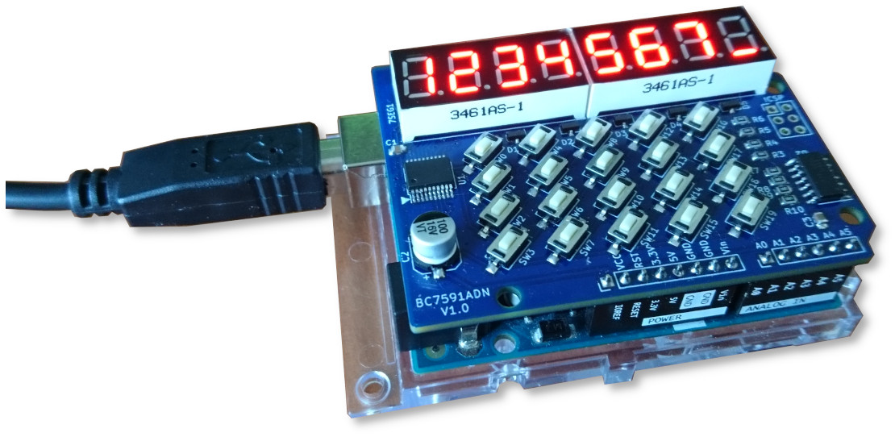
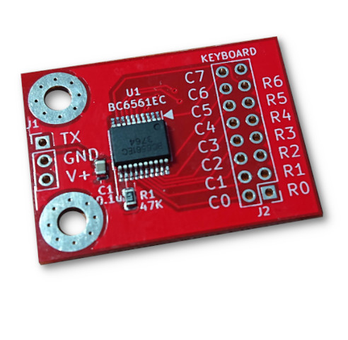

# BC6xxx BC759x Key Scan Library For Arduino

This library is for the BC6xxx & BC759x chips' matrix keyboard interface. It uses UART (hardware serial or software serial) to communicate.

An Arduino shield made with BC7591 chip

A 56-key(7*8) keyboard circuit made with BC6561

## About BC6xxx & BC759x chips

BC6xxx and BC759x chips both provides matrix keyboard interface. They use UART for communication. BC6xxx are dedicated keyboard interface range from 30 keys to 88 keys, while the BC759x can provide from 48 keys to 96 keys keyboard. They use a compatible UART protocol for the keyboard output, which is a 1-wire interface.

## About this library

This library wraps up all the low level serial port operations and provides user the simplest way to accomplish a full featured keyboard with the following functions:

- single key press detection

- single key release detection

- combined key press detection

- single key long-press detection

- key combination long press detection

- "no key press" detection

## Compatibility

This library works with any Arduino architechture which has serial port ability, either hardware serial or software serial.
